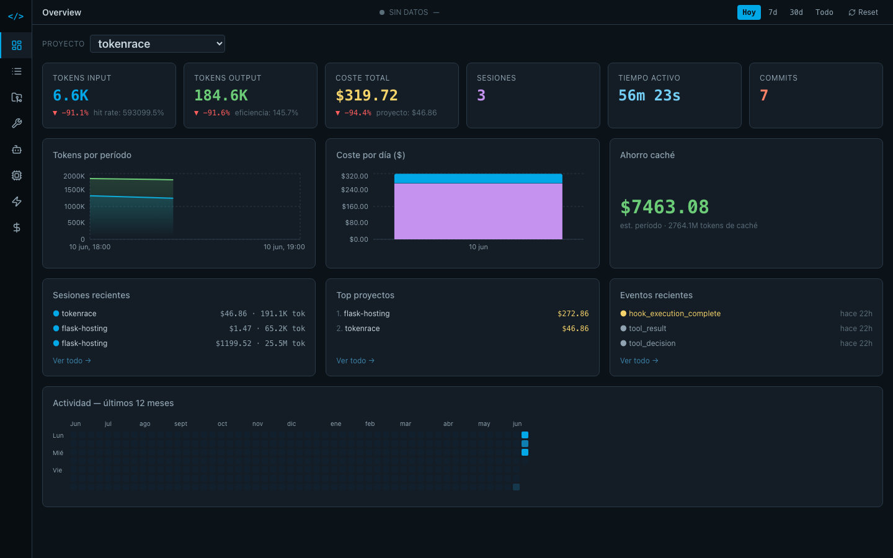

# tokenrace

Real-time token, cost and session monitor for [Claude Code](https://claude.ai/code).

Run one command — tokenrace starts a local server that receives telemetry from Claude Code via OpenTelemetry and shows it in a live dashboard in your browser.

```bash
npx tokenrace
```



---

## What it shows

- **Tokens** — input, output and cache tokens per session and over time
- **Cost** — total cost, cost per project, cost per day
- **Sessions** — every Claude Code session with duration, model, tool calls
- **Projects** — group sessions by project, compare cost and efficiency
- **Tools** — which tools Claude uses most (Bash, Edit, Read…) and approval rate
- **Events** — live feed of every API request, tool use and hook
- **Agents** — tree view of multi-agent hierarchies
- **Cache efficiency** — cache hit rate and estimated savings

---

## Requirements

- Node.js 18 or later
- Claude Code CLI

---

## Setup

### 1. Start tokenrace

```bash
npx tokenrace
```

The dashboard opens automatically at `http://localhost:1337`.

### 2. Enable telemetry in Claude Code

Paste this in your terminal **before** running `claude`:

```bash
export CLAUDE_CODE_ENABLE_TELEMETRY=1
export OTEL_METRICS_EXPORTER=otlp
export OTEL_LOGS_EXPORTER=otlp
export OTEL_EXPORTER_OTLP_PROTOCOL=http/json
export OTEL_EXPORTER_OTLP_ENDPOINT=http://localhost:1337
export OTEL_EXPORTER_OTLP_METRICS_TEMPORALITY_PREFERENCE=cumulative
```

### 3. Label your session (optional)

You can tag sessions from the dashboard, or set a project name upfront:

```bash
export OTEL_RESOURCE_ATTRIBUTES="project=my-project"
```

### 4. Run Claude Code

```bash
claude
```

Data appears in the dashboard immediately.

---

## Persistent data

tokenrace saves all data to `~/.tokenrace/data.json`. Data persists across restarts — use the **Reset** button in the dashboard to clear it.

---

## Options

| Environment variable | Default | Description |
|---|---|---|
| `TOKENRACE_PORT` | `1337` | Port for the dashboard and OTLP receiver |

---

## How it works

```
Claude Code → OTLP HTTP/JSON → localhost:1337/v1/*
                                        ↓
                           in-memory store + ~/.tokenrace/data.json
                                        ↓
                         REST API + Server-Sent Events
                                        ↓
                         React dashboard at localhost:1337/
```

A single Node.js process handles everything: OTLP receiver, REST API, SSE stream and static file serving.

---

## License

MIT
